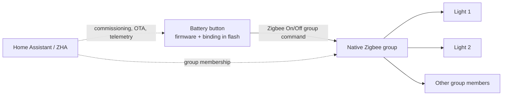

# Zigbee Direct Button

**A short press toggles the room. A hold turns every bound light off. The button sends both commands over Zigbee without a Home Assistant automation.**

This project adds an opt-in **ShortPressLongOff** mode to the experimental [Tuya Zigbee Switch firmware](https://github.com/romasku/tuya-zigbee-switch). It includes readable firmware source, tests, a Linux build recipe, a narrowly scoped ZHA quirk, and a complete commissioning and recovery guide.

The supported build is deliberately specific: a **Tuya TS0041 with manufacturer `_TZ3000_mrpevh8p`, Telink TLSR8258, battery EndDevice hardware**. After conversion it reports **`TS0041-TB` / `mrpevh8p`**. “TS0041” by itself is not enough to identify compatible hardware. Other TS0041 variants can use different chips and pin assignments.

## What changes

- **Short press:** release the key before the threshold to send the configured short action, normally Toggle, directly to the bound Zigbee group.
- **Hold:** keep the key down for 1,000 ms to send one absolute Off command. Releasing it sends no extra Toggle or dimming command.
- **Hold again:** already-off lights remain off; an absolute Off also brings a mixed on/off group back to off if every lamp receives it.
- **Existing behavior is preserved:** the new mode is opt-in. Flashing alone leaves the previous stored mode in place.

The short action happens on release so holding an already-dark room does not first flash its lights on. “Off” describes the command, not a delivery guarantee: an unpowered or unreachable lamp cannot receive it.



An HA light-group helper and a native Zigbee group are different things. The latter is required for this command path. The Zigbee network, the button's parent/router, and powered lamps still matter. This does not bind a Zigbee button directly to Matter-only lights.

## Current evidence

- **Earlier upstream baseline:** direct group Toggle was physically verified to switch five Zigbee lamps promptly with the old HA button automation disabled. That observation predates the hold-to-off update.
- The new hold-to-off implementation passes **243 host simulation tests**, including 12 checks of its command behavior across two build variants.
- **Hold-to-off is compiled, installed, and configured on the reference button.** The device reports `0x11033001`; uncached reads confirm Momentary, ToggleSimple, ShortPressLongOff, and a 1,000 ms threshold. The normal OTA took about 29 minutes 52 seconds. **Physical acceptance of the new short-press/hold behavior is still pending.** See [validation](docs/validation.md) for the evidence and remaining checks.
- A post-update HA snapshot confirms five registered native-group members, five lamp entities in the HA helper, and the old HA button automation disabled. This is registration/state evidence; fresh lamp acknowledgments and physical confirmation of the new behavior remain pending.
- A whole-HA-stopped test and a battery-removal persistence test **after installing the new firmware** have not been performed. The battery restart used to initiate the update does not establish either result.

## Start here

1. [Identify the hardware and understand the design](docs/design.md).
2. [Build and inspect the image](docs/build.md). No HA credentials are needed to build it.
3. [Back up, convert if necessary, and update](docs/upgrade.md).
4. [Create the native group, bind it, and configure ZHA](docs/home-assistant.md).
5. [Verify short press, hold, power persistence, and recovery](docs/validation.md).
6. [Troubleshoot symptoms](docs/troubleshooting.md) or [roll back](docs/recovery.md).

Already converted and comfortable with ZHA? Build the image, install the target-only quirk, use a local OTA provider, wait for a verified installed version of **`0x11033001`**, then set **Momentary + ToggleSimple + ShortPressLongOff + 1,000 ms**. Preserve the native group and leave the old HA toggle automation disabled. Follow the runbooks before doing this on hardware.

## Build

Docker must be running. On Linux x86_64 or an Apple Silicon Mac with amd64 emulation:

```sh
docker build --platform linux/amd64 -t zigbee-direct-button .
mkdir -p output
docker run --rm --platform linux/amd64 \
  -v "$PWD/output:/output" zigbee-direct-button
```

The container runs the host tests, fetches the Telink SDK and checksummed compiler, and produces `.bin`, `.zigbee`, metadata, and `SHA256SUMS` in `output/`. It does not access HA or start an update. See [build details and reproducibility limits](docs/build.md).

## Repository map

- `src/`, `tests/`: firmware and inherited test harness, plus the new hold-to-off tests.
- `patches/hold-off.patch`: focused code delta against the exact upstream release source.
- `scripts/`: build, OTA inspection, and local-index generation tools.
- `examples/home-assistant/`: target-only runtime quirk and generic configuration.
- `docs/`: design, deployment, backup, recovery, diagnostics, and test evidence.
- `PROVENANCE.json`: source version, build target, and compiler checksum.
- `zha/`, `helper_scripts/`, device database, and Makefiles: inherited upstream development sources. **Use the target-only example quirk for deployment; do not install the broad generated development quirk.**

No network backups, live device identifiers, network addresses, access tokens, or private deployment logs belong here. [Security and privacy](SECURITY.md) explains what to keep outside Git.

## Credits and scope

The firmware, hardware configuration, original integrations, and test harness come from [romasku/tuya-zigbee-switch](https://github.com/romasku/tuya-zigbee-switch), pinned to `ec57f81b89e7755c4a8833cc6cb081ba3cdda227` (1.1.3). This repository carries a small behavior change and an operational guide, not a claim of authorship of the upstream project. The original [license](LICENSE) is preserved. Compiled images also incorporate Telink SDK components under their own license. See [third-party notices](THIRD_PARTY_NOTICES.md); downloaded SDK and compiler distributions are not vendored here.
